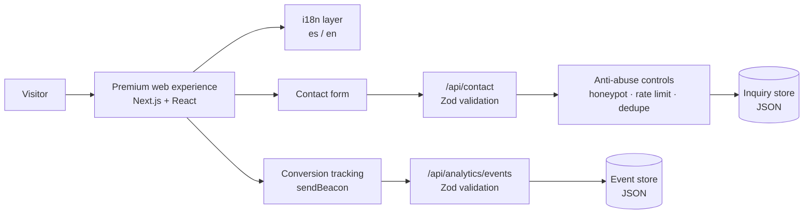
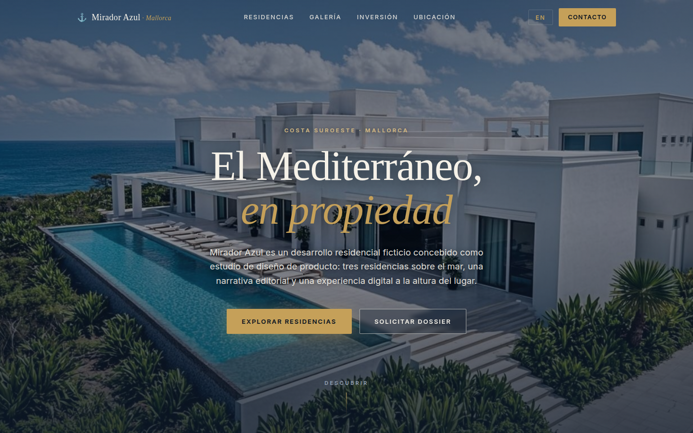
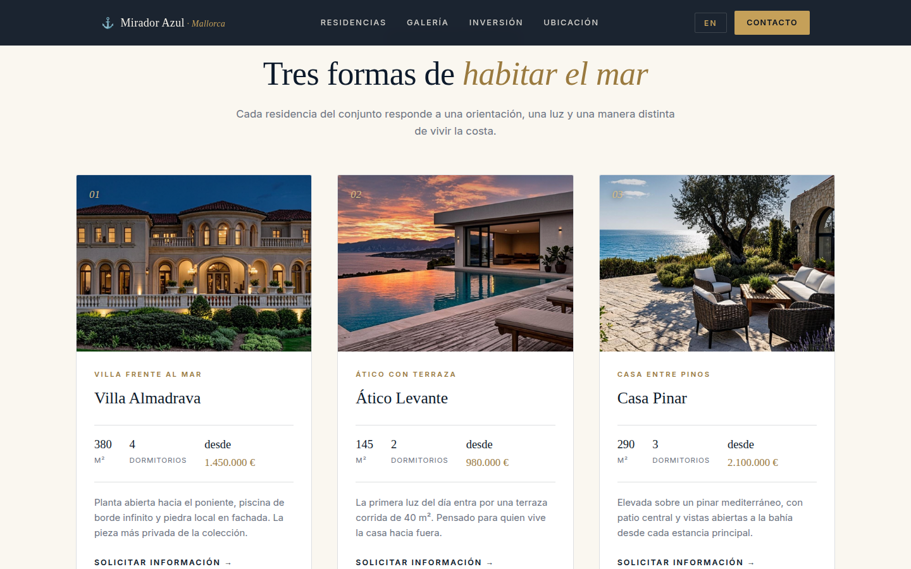
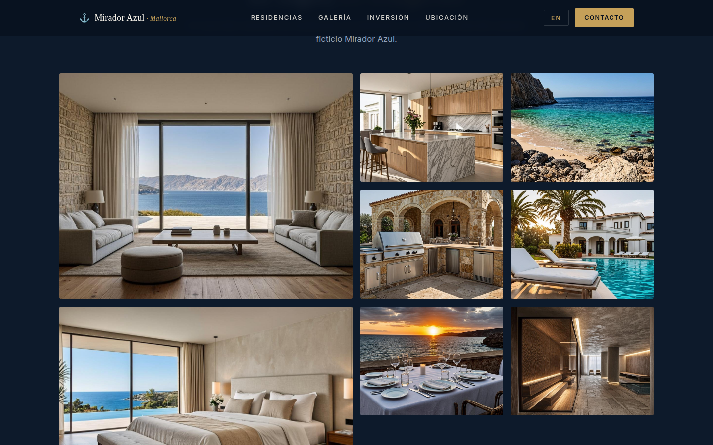
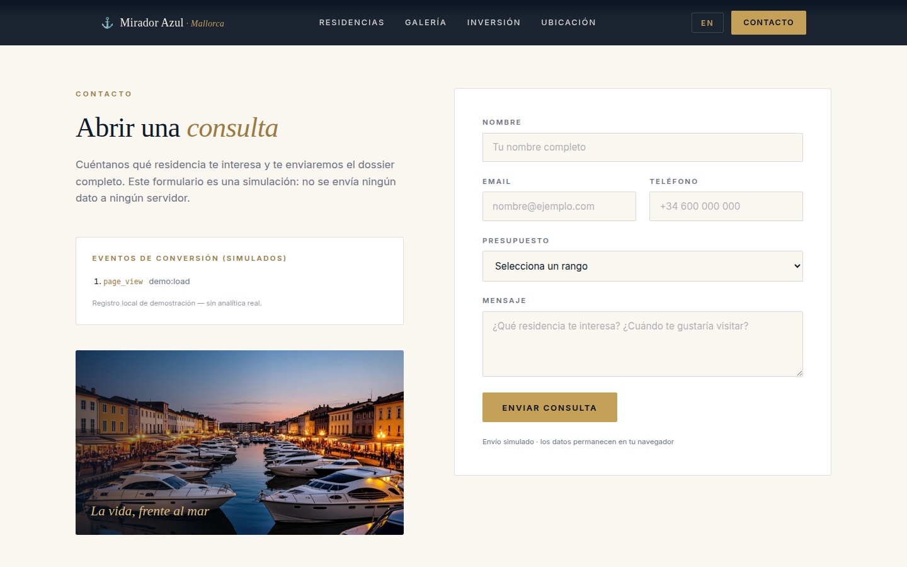
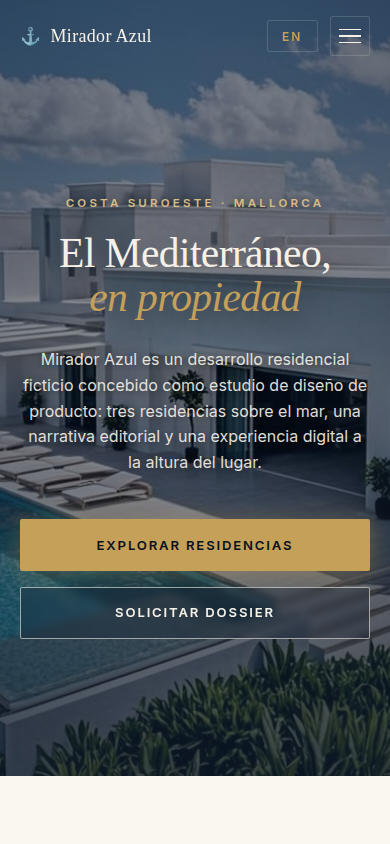

<div align="center">
  

  # Anclora Portfolio

  **Premium digital experience for luxury real estate — a product and engineering case study**

  `Next.js 16` · `React 19` · `TypeScript 5` · `Tailwind CSS 4` · `Zod` · `Vitest`

  [Versión en español → README.md](README.md)
</div>

---

> [!IMPORTANT]
> This repository is a reduced case study for professional portfolio purposes.
> All properties, prices, investment figures and commercial content shown are
> fictional and used exclusively to demonstrate product design and software
> engineering capabilities.
> It does not contain the complete operational source code, customer data,
> credentials, production configuration, or sensitive proprietary logic.

> [!IMPORTANT]
> Este repositorio es un case study reducido para portfolio profesional.
> Todas las propiedades, precios, cifras de inversión y contenidos comerciales
> mostrados son ficticios y se utilizan exclusivamente para demostrar capacidades
> de diseño de producto e ingeniería de software.
> No contiene el código fuente operativo completo, datos de clientes,
> credenciales, configuración de producción ni lógica propietaria sensible.

> [!NOTE]
> All data shown in this repository is fictional and used exclusively for professional portfolio demonstration purposes.
> Todos los datos mostrados en este repositorio son ficticios y se utilizan exclusivamente con fines de demostración profesional.

---

## Live Demo

**[Open live demo → anclora-portfolio-showcase.vercel.app](https://anclora-portfolio-showcase.vercel.app)**

This repository now includes a deployable interactive demo (Vite + React + TypeScript) that recreates the experience with fictional data and simulated interactions. To run it locally: `npm install && npm run dev`. See [docs/demo-architecture.md](docs/demo-architecture.md).

## The problem

In luxury real estate, the website is the first property viewing. A premium residential development competes for buyers who judge the product by its digital presentation long before setting foot on site: a generic, slow or poorly mobile-adapted experience destroys perceived value. And when interest does emerge, a contact form without validation, abuse protection or measurement turns lead capture into a black box: low-quality leads, spam and no way to know which channels actually work.

## The solution

Anclora Portfolio is a premium digital experience built for a fictional luxury residential development in Mallorca. The page walks visitors through a carefully crafted narrative — immersive hero, blueprint, storytelling, investment, residences, location, FAQs and contact — with a fully bilingual (es/en) interface and a responsive design meant to convey premium positioning on any device.

The technical approach prioritizes reliable conversion: a contact form validated on both client and server, anti-abuse controls in the API (honeypot, deduplication, rate limiting), conversion-event tracking with UTM/referrer attribution and funnel analytics. Performance is protected through deferred section loading and optimized images.

## At a glance

| Area | What it demonstrates |
|---|---|
| Product Design | Premium positioning and conversion-oriented narrative |
| Frontend | Responsive architecture and reusable components |
| Internationalisation | Complete ES/EN experience |
| Lead Capture | Validation and protection of the contact flow |
| Conversion | Event tracking and attribution |
| Backend | Verified APIs and persistence abstractions |
| Security | Validation, honeypot and rate limiting |
| Quality | Lint, type-check, tests and build |

## High-level flow

```text
Attraction
        ↓
Exploration
        ↓
Premium content
        ↓
Interest
        ↓
Lead Capture (contact form)
        ↓
Validation and anti-abuse controls
        ↓
Conversion Event
        ↓
Analytics
```

## Architecture



More detail in [docs/architecture.md](docs/architecture.md).

## Screenshots (synthetic data)

| Image-driven hero | Residences |
|---|---|
|  |  |

| Image gallery | Lead capture form |
|---|---|
|  |  |

| Mobile experience |
|---|
|  |

The screenshots come from the interactive demo in this repository, which runs on fictional data; they do not come from the operational environment.

## Lead capture and conversion capabilities

- **Conversion-oriented journey**: the entire page is structured as a funnel — from attraction to contact — with calls to action in the hero, navigation and floating sidebar.
- **Form validated on client and server**: a dedicated hook provides immediate client-side validation, and a Zod schema with `safeParse` and sanitization is the real boundary on the server; no malformed data reaches persistence.
- **Honeypot**: a hidden field that detects bots and answers `202` without persisting anything — spam never pollutes the lead store.
- **Duplicate protection**: time-window deduplication (email + phone + interest) that answers `202 {deduped:true}` without writing again.
- **Rate limiting**: per-IP request limiting on the contact API, answered with `429` and a `Retry-After` header.
- **Conversion events**: tracking of CTA clicks and the form lifecycle (attempt, success, error), sent with `navigator.sendBeacon` and a fetch fallback.
- **UTM/referrer attribution**: campaign parameters and the referrer are captured on first touch and attached to every event.
- **Funnel analytics**: funnel aggregation (submit success rate) and a channel ranking by UTM source.

Technical detail in [docs/conversion-and-lead-capture.md](docs/conversion-and-lead-capture.md).

## Engineering

- **Next.js 16 (App Router) + React 19 + TypeScript 5**, with standalone output for deployment.
- **Tailwind CSS 4 + shadcn/Radix UI** as the visual system, with framer-motion for the motion layer.
- **Unified i18n**: a single translations module with complete `es` and `en` trees, browser-language detection, localStorage persistence and synchronized `document.lang` — no locale routing.
- **Deferred section loading**: `next/dynamic` for everything below the hero; sections mount after the first scroll, touch or keypress.
- **Optimized images**: `next/image` with AVIF/WebP, a priority hero image and responsive `sizes`.
- **Tests with Vitest 4 + Testing Library**: API routes, hooks and utilities.
- **Quality gates and CI**: lint, type-check, tests and build on every PR/push; a Lighthouse KPI gate; pre-commit with husky + lint-staged.

## What this project demonstrates

This project demonstrates hands-on experience in:

- premium, conversion-oriented product design;
- modern frontend engineering (Next.js, React, TypeScript);
- responsive UX across devices;
- full experience internationalization;
- API design with clear contracts;
- data validation and sanitization;
- lead capture with anti-abuse controls;
- conversion analytics and attribution;
- multi-level testing;
- security applied to the contact flow;
- maintainable software architecture.

## Documentation

- [docs/product-overview.md](docs/product-overview.md) — problem, audience and value proposition
- [docs/architecture.md](docs/architecture.md) — high-level architecture
- [docs/demo-architecture.md](docs/demo-architecture.md) — deployable interactive demo (Vite + React + TypeScript)
- [docs/conversion-and-lead-capture.md](docs/conversion-and-lead-capture.md) — capture and conversion pipeline
- [docs/engineering-decisions.md](docs/engineering-decisions.md) — engineering decisions
- [docs/security-and-privacy.md](docs/security-and-privacy.md) — security and privacy principles
- [docs/testing-and-quality.md](docs/testing-and-quality.md) — testing and quality strategy
- [examples/synthetic/](examples/synthetic/) — fictional sample data

## License

**All Rights Reserved — Portfolio Evaluation Only.**

The materials in this repository are available solely for professional evaluation (recruiting, collaboration, technical due diligence). No permission is granted for reuse, redistribution or commercial use. See [LICENSE](LICENSE).
