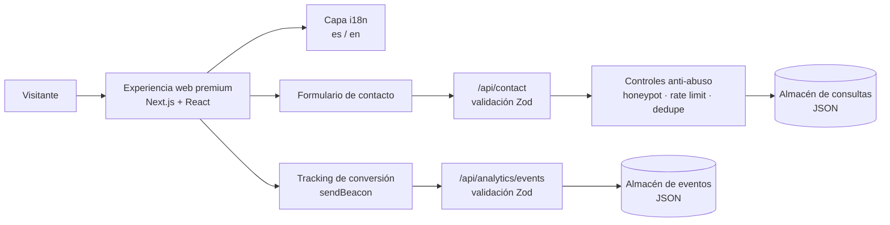
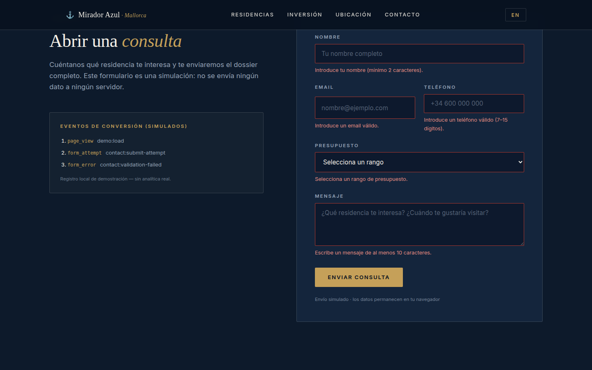
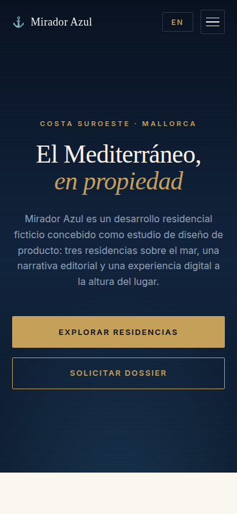

<div align="center">
  

  # Anclora Portfolio

  **Experiencia digital premium para Real Estate de lujo — case study de producto e ingeniería**

  `Next.js 16` · `React 19` · `TypeScript 5` · `Tailwind CSS 4` · `Zod` · `Vitest`

  [English version → README.en.md](README.en.md)
</div>

---

> [!IMPORTANT]
> Este repositorio es un case study reducido para portfolio profesional.
> Todas las propiedades, precios, cifras de inversión y contenidos comerciales
> mostrados son ficticios y se utilizan exclusivamente para demostrar capacidades
> de diseño de producto e ingeniería de software.
> No contiene el código fuente operativo completo, datos de clientes,
> credenciales, configuración de producción ni lógica propietaria sensible.

> [!IMPORTANT]
> This repository is a reduced case study for professional portfolio purposes.
> All properties, prices, investment figures and commercial content shown are
> fictional and used exclusively to demonstrate product design and software
> engineering capabilities.
> It does not contain the complete operational source code, customer data,
> credentials, production configuration, or sensitive proprietary logic.

> [!NOTE]
> Todos los datos mostrados en este repositorio son ficticios y se utilizan exclusivamente con fines de demostración profesional.
> All data shown in this repository is fictional and used exclusively for professional portfolio demonstration purposes.

---

## Live Demo

**[Abrir demo en vivo → anclora-portfolio-showcase.vercel.app](https://anclora-portfolio-showcase.vercel.app)**

Este repositorio incluye ahora una demo interactiva desplegable (Vite + React + TypeScript) que reproduce la experiencia con datos ficticios e interacciones simuladas. Para ejecutarla en local: `npm install && npm run dev`. Ver [docs/demo-architecture.md](docs/demo-architecture.md).

## El problema

En el Real Estate de lujo, la web es la primera visita a la propiedad. Un desarrollo residencial premium compite por compradores que juzgan el producto por su presentación digital mucho antes de pisar el lugar: una experiencia genérica, lenta o mal adaptada al móvil destruye valor percibido. Y cuando el interés aparece, un formulario de contacto sin validación, sin protección frente a abuso y sin medición convierte la captación en una caja negra: leads de baja calidad, spam y ninguna forma de saber qué canales funcionan.

## La solución

Anclora Portfolio es una experiencia digital premium construida para un desarrollo residencial de lujo ficticio en Mallorca. La página guía al visitante por una narrativa cuidada — hero inmersivo, blueprint, storytelling, inversión, residencias, ubicación, FAQs y contacto — con una interfaz bilingüe (es/en) completa y un diseño responsive pensado para transmitir posicionamiento premium en cualquier dispositivo.

El enfoque técnico prioriza la conversión con fiabilidad: formulario de contacto validado en cliente y servidor, controles anti-abuso en la API (honeypot, deduplicación, rate limiting), tracking de eventos de conversión con atribución por UTM/referrer y analítica de embudo. Todo el rendimiento se cuida con carga diferida de secciones e imágenes optimizadas.

## At a glance

| Área | Qué demuestra |
|---|---|
| Product Design | Posicionamiento premium y narrativa orientada a conversión |
| Frontend | Arquitectura responsive y componentes reutilizables |
| Internationalisation | Experiencia ES/EN completa |
| Lead Capture | Validación y protección del flujo de contacto |
| Conversion | Tracking de eventos y atribución |
| Backend | APIs y abstracciones de persistencia verificadas |
| Security | Validación, honeypot y rate limiting |
| Quality | Lint, type-check, tests y build |

## Flujo de alto nivel

```text
Atracción
        ↓
Exploración
        ↓
Contenido premium
        ↓
Interés
        ↓
Lead Capture (formulario de contacto)
        ↓
Validación y controles anti-abuso
        ↓
Conversion Event
        ↓
Analytics
```

## Arquitectura



Más detalle en [docs/architecture.md](docs/architecture.md).

## Capturas (datos sintéticos)

| Hero premium | Residencias |
|---|---|
|  |  |

| Formulario de captación | Experiencia móvil |
|---|---|
|  |  |

Las capturas proceden de la demo interactiva de este repositorio, que funciona con datos ficticios; no proceden del entorno operativo.

## Capacidades de captación y conversión

- **Journey orientado a conversión**: la página entera está estructurada como un embudo — de la atracción al contacto — con llamadas a la acción en hero, navegación y sidebar flotante.
- **Formulario validado en cliente y servidor**: hook dedicado con validación inmediata en cliente, y esquema Zod con `safeParse` y sanitización como frontera real en servidor; ningún dato mal formado llega a la persistencia.
- **Honeypot**: campo oculto que detecta bots y responde `202` sin persistir nada — el spam no ensucia el almacén de leads.
- **Protección frente a duplicados**: deduplicación por ventana temporal (email + teléfono + interés) que responde `202 {deduped:true}` sin escribir de nuevo.
- **Rate limiting**: límite de peticiones por IP en la API de contacto, con respuesta `429` y cabecera `Retry-After`.
- **Eventos de conversión**: tracking de clics en CTAs y del ciclo de vida del formulario (intento, éxito, error), enviados con `navigator.sendBeacon` y fallback a fetch.
- **Atribución UTM/referrer**: los parámetros de campaña y el referrer se capturan en el primer contacto y acompañan a cada evento.
- **Analítica de embudo**: agregación del funnel (tasa de éxito de envío) y ranking de canales por fuente UTM.

Detalle técnico en [docs/conversion-and-lead-capture.md](docs/conversion-and-lead-capture.md).

## Ingeniería

- **Next.js 16 (App Router) + React 19 + TypeScript 5**, con salida standalone para despliegue.
- **Tailwind CSS 4 + shadcn/Radix UI** como sistema visual, con framer-motion para la capa de motion.
- **i18n unificada**: un único módulo de traducciones con árboles completos `es` y `en`, detección de idioma del navegador, persistencia en localStorage y `document.lang` sincronizado — sin routing por locale.
- **Carga diferida de secciones**: `next/dynamic` para todo lo que está por debajo del hero; las secciones se montan tras el primer scroll, toque o pulsación de tecla.
- **Imágenes optimizadas**: `next/image` con AVIF/WebP, imagen de hero prioritaria y `sizes` responsive.
- **Tests con Vitest 4 + Testing Library**: rutas API, hooks y utilidades.
- **Gates de calidad y CI**: lint, type-check, tests y build en cada PR/push; gate de KPIs de Lighthouse; pre-commit con husky + lint-staged.

## Qué capacidades demuestra este proyecto

Este proyecto demuestra experiencia práctica en:

- diseño de producto premium orientado a conversión;
- ingeniería frontend moderna (Next.js, React, TypeScript);
- UX responsive en múltiples dispositivos;
- internacionalización completa de la experiencia;
- diseño de APIs con contratos claros;
- validación y sanitización de datos;
- captación de leads con controles anti-abuso;
- analítica de conversión y atribución;
- testing en varios niveles;
- seguridad aplicada al flujo de contacto;
- arquitectura de software mantenible.

## Documentación

- [docs/product-overview.md](docs/product-overview.md) — problema, audiencia y propuesta de valor
- [docs/architecture.md](docs/architecture.md) — arquitectura de alto nivel
- [docs/demo-architecture.md](docs/demo-architecture.md) — demo interactiva desplegable (Vite + React + TypeScript)
- [docs/conversion-and-lead-capture.md](docs/conversion-and-lead-capture.md) — pipeline de captación y conversión
- [docs/engineering-decisions.md](docs/engineering-decisions.md) — decisiones de ingeniería
- [docs/security-and-privacy.md](docs/security-and-privacy.md) — principios de seguridad y privacidad
- [docs/testing-and-quality.md](docs/testing-and-quality.md) — estrategia de testing y calidad
- [examples/synthetic/](examples/synthetic/) — datos de ejemplo ficticios

## Licencia

**All Rights Reserved — Portfolio Evaluation Only.**

Los materiales de este repositorio están disponibles únicamente para evaluación profesional (reclutamiento, colaboración, due diligence técnica). No se concede permiso de reutilización, redistribución ni uso comercial. Ver [LICENSE](LICENSE).
