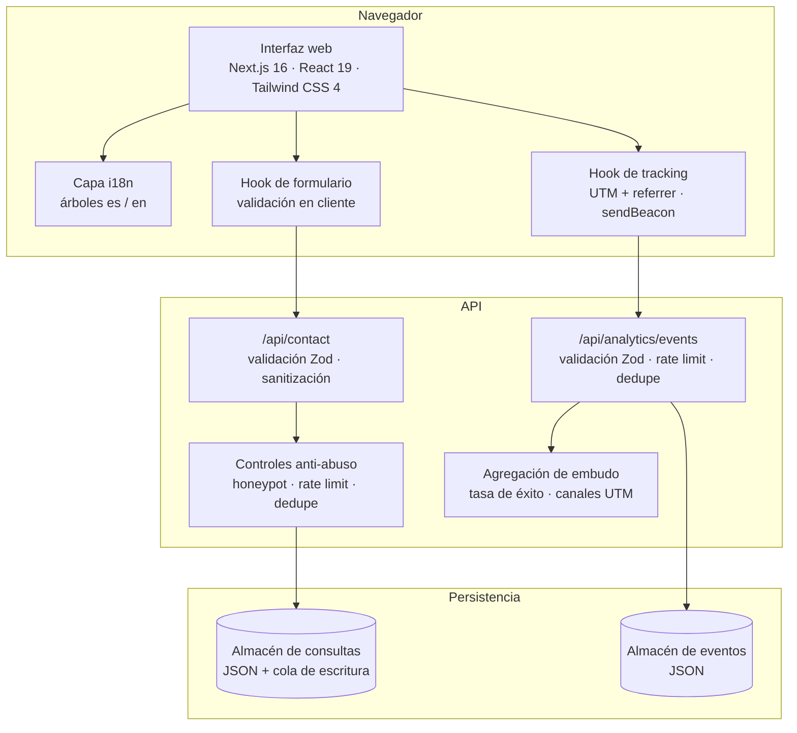

[← Volver al índice](../README.md)

# Arquitectura de alto nivel

> Todos los datos mostrados en este documento son ficticios y se utilizan exclusivamente con fines de demostración profesional.

## Visión general

Anclora Portfolio es una aplicación Next.js 16 (App Router) con React 19 y TypeScript 5 en todo el proyecto. El sistema visual se apoya en Tailwind CSS 4 y componentes shadcn/Radix UI, con framer-motion para la capa de motion. El servidor expone dos API routes — captación de contacto y eventos de analítica — que validan su entrada con Zod y persisten a través de una abstracción de almacén JSON. La descripción que sigue es deliberadamente de alto nivel: se omiten rutas internas, configuraciones y detalles operativos.

## Capas

### Frontend y secciones

La interfaz es una experiencia de una página organizada en secciones de producto: navegación superior, hero inmersivo, blueprint, storytelling, inversión, features, galería, residencias, ubicación, FAQs, contacto, footer y un sidebar flotante. Cada sección es un componente independiente y reutilizable, con breakpoints responsive de Tailwind aplicados de forma sistemática.

Rendimiento como requisito de producto:

- **Carga diferida**: todas las secciones por debajo del hero se importan con `next/dynamic` y se montan tras el primer scroll, toque o pulsación de tecla del visitante.
- **Imágenes**: `next/image` con formatos AVIF/WebP, la imagen del hero marcada como prioritaria y atributos `sizes` responsive.
- **Salida standalone**: el build produce un artefacto autocontenido para despliegue.

### Internacionalización

Un módulo de traducciones único contiene los árboles completos `es` y `en`. Un hook de estado de idioma gestiona la selección con detección del idioma del navegador, persistencia en localStorage y sincronización de `document.lang`; el cambio de idioma se ofrece en la navegación. No hay routing por locale: una sola URL sirve ambos idiomas.

### Formulario y validación

El formulario de contacto usa un hook dedicado con validación inmediata en cliente y un timeout de 10 segundos en el envío. En servidor, la API route valida de nuevo con Zod (`safeParse`): nombre, email, teléfono, rango de presupuesto, interés (enum) y mensaje, aplicando transforms de sanitización a la entrada. La validación en cliente mejora la experiencia; la de servidor es la que protege.

### Capa API

Las API routes del propio Next.js son la única puerta de entrada al servidor:

- **`/api/contact`** — recibe el envío del formulario, lo valida, aplica los controles anti-abuso y persiste la consulta.
- **`/api/analytics/events`** — recibe eventos de conversión, los valida con Zod, los limita por tasa (60 req/min), los deduplica en una ventana de 2 segundos y los persiste. Una operación de lectura agrega el embudo (tasa de éxito de envío) y el ranking de canales por fuente UTM.

Ninguna de las dos rutas expone detalle interno en sus respuestas de error: los códigos de estado (`201/202/400/429/500`) son el contrato (ver [conversion-and-lead-capture.md](conversion-and-lead-capture.md)).

### Abstracciones de persistencia

La persistencia se resuelve mediante una **abstracción de almacén basada en ficheros JSON**, con una cola de escritura que serializa las mutaciones. La interfaz del almacén es intercambiable: el mismo contrato admitiría una implementación sobre una base de datos real sin tocar las rutas que lo consumen. En el contexto de este producto, es deliberadamente simple — no es una base de datos y no pretende serlo.

### Analítica y tracking

Un hook cliente captura los parámetros UTM y el referrer en el primer contacto del visitante (cacheados por sesión) y deriva el tipo de dispositivo a partir del user agent. Los eventos — clics en los CTAs del hero, clic de contacto en la navegación y ciclo de vida del formulario (intento, éxito, error) — se envían con `navigator.sendBeacon` y un fallback a `fetch`, de modo que la navegación o el cierre de la página no pierden el evento.

## Decisiones estructurales clave

- **Una sola puerta de entrada**: toda escritura pasa por una API route validada; el frontend nunca persiste directamente.
- **Validación en la frontera**: los esquemas Zod viven en la API, no en la lógica interna — ninguna petición mal formada avanza.
- **Defensa en profundidad en la captación**: honeypot, deduplicación y rate limiting como capas independientes (ver [engineering-decisions.md](engineering-decisions.md)).
- **Persistencia intercambiable**: la abstracción de almacén separa el contrato de la implementación.
- **Analítica propia y mínima**: sin trackers de terceros; solo los eventos que el embudo necesita (ver [security-and-privacy.md](security-and-privacy.md)).

## Documentos relacionados

- [conversion-and-lead-capture.md](conversion-and-lead-capture.md) — el pipeline de captación etapa a etapa
- [engineering-decisions.md](engineering-decisions.md) — por qué se decidió así
- [testing-and-quality.md](testing-and-quality.md) — cómo se verifica esta arquitectura
